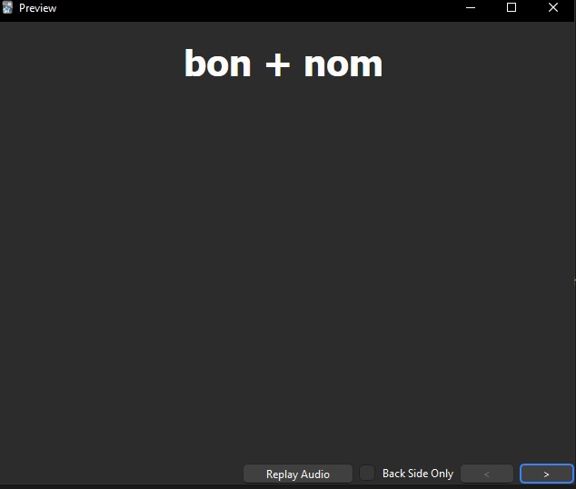
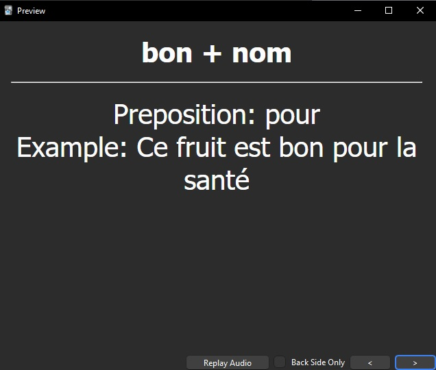

# French Notes

My French learning notes on grammar and vocab. Set up for importing into Anki and also viewable in markdown format.

## Structure

- Source files are in `src/`
- Grammar files are written in markdown, vocab files are CSVs. I recommend using a proper CSV editor for updating them. I'm using ReprEng's CSV extension in VS Code.
- You can generate the equivalent files in Anki format or Markdown with the included scripts (requires python >= 3.11)

## Scripts

To generate the compiled files:

1. First time only: install the requirements
  - `pip install -r requirements.txt`
2. Run the generator:
  - `python -m scripts.generate`
3. Files will be generated into `anki/` and `md/` for Anki and Markdown respectively
4. Can also run the generator with `--clear` to remove all destination files before generating

## Anki

- Anki is an app used for helping you memorise things. It basically works through flash cards and periodic reminders. e.g. you view a card once and then if you know it you won't see it again for a day, then 2, then a week, etc.
- You can import the files from here to load into your app and then start practicing

### Example

### Import via apkg

- **Recommended**
- Find the [latest release](https://github.com/saltisgood/FrenchNotes/releases/latest) and download the apkg file
- Open the Anki app and click `File / Import`. **Don't select to import progress**

### Import via individual files

- **For advanced users**
- This repo contains all the individual files that make up the collection which you can import individually if you like
- From the main area in the app, click on `Import File`
- Select the file you want to import
- You may have to precreate the decks and note types!
- Check the fields look correctly mapped and click `Import`
- **Remember to sync to/from your other devices**

### Basic Anki Windows app instructions

- Create deck: On main screen, bottom centre button `Create Deck`. Enter a name with levels separated by `::`
- To adjust styling: From main screen, click the top centre button `Browse`. Click on a deck and card that you want to change. Click on `Cards...` button.
- To adjust fields: Same as above but click on `Fields...` button.

## TODO

- Remove the `Noun:`, `Adjective:`, etc prefixes and just generate them dynamically
- Add colour styling in the markdown generation for vocab
- Add a noun endings deck